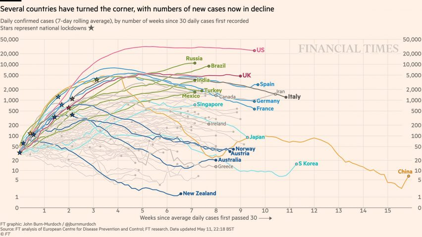

```{r setup, include=FALSE}
knitr::opts_chunk$set(echo = TRUE)#, 
                      #fig.width = "75%")

# max 15 paginas 
# usar o default (margens superior e esquerda 2,5cm, inferior e direita 3cm, 
# Times 12 e espaçamento 1,5).

used_pkgs <- renv::dependencies()$Package |>
  unique()

knitr::write_bib(x = used_pkgs, file = 'references/pkgs_references.bib')

sapply(fs::dir_ls('fcts') ,
       function(x) invisible(source(x)))

book_page <- "https://github.com/msperlin/chapter-dataviz-saude.gov"
```

# Introdução {#introducao}

Um dos grandes desafios de pesquisadores científicos é conseguir comunicar resultados de forma clara e efetiva. Enquanto um artigo científico possui um público muito específico -- outros professores e pesquisadores --, gráficos construídos a partir dos dados analisados podem sensibilizar e comunicar resultados de uma forma muito mais abrangente [@borner2019data; @kohlhammer2012toward]. Na prática, poucos conseguem avaliar o resultado de um modelo estatístico, enquanto uma representação gráfica de dados bem feita pode ser avaliada pelo público com arcabouço técnico muito menor [@franconeri2021science]. 

Assim, a produção de gráficos baseada em dados se torna uma poderoso aliada do pesquisador ao informar, de forma simples e direta, informações que estão escondidas ao olho nu. Indiscutivelmente, o principal objetivo de qualquer análise de dados é a comunicação. Gráficos e diagramas facilitam este processo ao apresentar lógicas espaciais e fáceis de entender. O argumento visual é forte e cria um memorável impacto. O seu trabalho como analista de dados de saúde é facilitar esta análise para o seu público, criando gráficos que são instrutivos e que transmitam uma mensagem direta e intuitiva. 

O inquestionável sucesso de sites como *Instagram*, *Twitter* e *Facebook* mostram o extremo grau de capilaridade digital que uma figura pode apresentar, por mais técnica que ela seja. Um gráfico apresentado em uma relatório técnico ou trabalho acadêmico pode facilmente se popularizar, amplificando o alcance da mensagem e promovendo o autor em sua área de trabalho.

Como um exemplo, na recente pandemia de 2020 (covid19), um dos gráficos reconhecido mundialmente foi criado pelo cientista de dados Burn Murdoch, atualmente empregado pelo _Financial Times_. O gráfico mostra a evolução do número de casos confirmados (média de sete dias) entre diversos países.

```{r, echo = FALSE, out.width="50%"}

```

A grande sacada do autor foi condensar informações de diferentes fontes em uma mesma representação visual. Para o leitor, fica fácil entender a dinâmica da contaminação da pandemia ao observar as curvas de diferentes países. Sem dúvida, cada elemento do gráfico foi pensado estrategicamente, desde a formação da escalas vertical e posição dos elementos, até as cores utilizadas para cada país. E, mais importante para este capítulo, o gráfico foi construído na mesma plataforma que iremos estudar aqui, o R!

Neste capítulo iremos estudar a forma de construção de gráficos no R. Este não é, de forma alguma, um conteúdo completo sobre o tema.  O objetivo aqui é apresentar um material prático sobre como criar figuras com o `ggplot2`. Iremos tomar alguns atalhos para condensar o conteúdo, e também não iremos discutir profundamente os pontos. Leitores que desejam aprender mais sobre o pacote, o melhor material é o livro do próprio autor, disponível gratuitamente na [internet](https://ggplot2-book.org/introduction.html) [@R-ggplot2].  

Em um primeiro passo, vamos deixar o código em si de lado para focar nos conceitos por trás de uma figura bem construída. Após isso, pPartimos então para o uso do pacote `ggplot2` e sua filosofia na criação de camadas da figura. Por fim, apresentamos diversos exemplos de gráficos construídos a partir dos dados do DataSUS.

Como deves esperar, este capítulo assume conhecimento do leitor no uso do R e RStudio para as seguintes operações:

-   Instalação do R e RStudio;
-   Instalação e carregamento de pacotes do R;
-   Criação e execução de funções e *scripts* no R;
-   Entendimento dos diferentes tipos de objetos no R;
-   Manipulação de `dataframes` com pacote `dplyr` [@R-dplyr], especificamente uso das funções `glimpse`, `group_by`, `count`,  `summarise`, e o operador nativo de _pipeline_ (`|>`).


# Princípios e Componentes {#principios}

O que torna a figura de Burn Murdoch tão impactante? Qual foi o processo de criação da figura? Neste capítulo vamos procurar responder estas questões através da discussão de princípios e componentes visuais de um gráfico de dados. Discutiremos elementos centrais e independentes da plataforma de programação.

Primeiro, e mais importante, é preciso reforçar que **a razão da análise de dados é a comunicação**. É seu trabalho como analista de dados ou pesquisador acadêmico traduzir informações retiradas de um banco de dados e sugerir possíveis efeitos no mundo real. Um relatório técnico -- produto do seu trabalho -- é nada mais que um parecer sobre um problema, onde um especialista apresenta sua opinião imparcial e técnica sobre o que está sendo discutido, muitas vezes suportado por uma hipótese central que delimita a pesquisa. O mesmo é verdadeiro para um trabalho acadêmico, onde se discute uma teoria baseada em dados, ou um trabalho profissional, onde o problema torna-se uma decisão de política pública.

Neste caso, um sólido parecer técnico terá o seu impacto limitado pela capacidade de comunicação do relatório. Veja que de nada adianta realizar um trabalho fantástico na análise de dados se a parte escrita e gráfica não consegue transmitir a mensagem de forma coerente e intuitiva. De fato, um dos erros frequentes encontrados na produção de trabalhos acadêmicos é focar mais na técnica do que na mensagem.

Mais próximo do tema do livro, gráficos são fortes elementos de comunicação e servem para convencer o leitor de uma determinada ideia. Assim, o primeiro princípio na criação de gráficos é que **uma figura deve justificar a sua existência** [@schwabish2014economist]. Remova todo o excesso! Um erro muito comum em iniciantes é tentar criar os mais variados gráficos sem se perguntar se os mesmos adicionam informações novas na análise. Só porque você pode fazer um gráfico, não significa que você deve mostrá-lo ao leitor. O valor de um conteúdo está diretamente relacionado às novas informações que ele traz na análise. Atenha-se àqueles que ajudam a transmitir sua mensagem. Não hesite em cortar elementos gráficos. Sempre que você encontrar uma figura que não seja discutida em pelo menos dois parágrafos do texto principal, não tenha receio em retirá-la do documento. Se não consegues escrever mais do que dois parágrafos sobre uma figura, provavelmente não é importante.

O segundo elemento principal na visualização de dados é **manipulação da atenção**, isto é, facilite e direcione a análise para o seu público. Verifique se os gráficos produzidos indicam uma mensagem clara e direta. Destaque nos gráficos o que o público deve procurar e como lê-lo. Não espere que todos tenham o mesmo conhecimento técnico. Entenda o que seu público espera e qual a motivação para ler o seu conteúdo. Por exemplo, não apresente para um grupo de executivos o mesmo material que apresenta para o seu orientador acadêmico. Cada um tem sua própria formação técnica, demandas e características, e irá avaliar o seu trabalho de forma diferente. Não é incomum um gráfico ser elogiado pelo público em geral mas rechaçado pelo público técnico. Esta manipulação de atenção não deve ser menosprezada. Por exemplo, os autores de @bazley2017red reportam significativas mudanças de expectativa futura e aversão ao risco pelo simples uso da cor vermelha em relatórios de investimento. Pequenas mudanças, alto impacto. 

O terceiro elemento é a **independência do elemento gráfico**. Todas informações técnicas, tais como origem e período de tempo dos dados, devem ser claramente indicadas no título, subtítulo ou legenda do gráfico. Se o leitor precisar buscar informações sobre a análise gráfica no próprio texto, então existe um espaço para melhoria do conteúdo. Isso pode ser mais fácil dizer do que fazer, mas tente comunicar o máximo de informações possíveis, desde que não polua o gráfico. Lembre-se de que existe um equilíbrio entre uma estética elegante e os detalhes técnicos.

Por fim, o quarto elemento é **herança e reproducibilidade**. A ciência e a análise de dados evoluem na forma de blocos de construção, um encima do outro. Sempre verifique os gráficos produzidos em suas referências. Eles guiarão sobre o que seu público espera. Da mesma forma, você pode até usar figuras de artigos anteriores para comparar seus resultados. Isso é especialmente conveniente quando os mesmos conjuntos de dados ou similares são usados. Por isso, sempre informe qual a origem dos dados utilizados no gráfico, facilitando que outra pessoa, ou até mesmo você, replique o gráfico

As diretrizes anteriores, embora resumidas, o ajudarão a criar material de maior impacto. Ao longo deste e demais capítulos, tentarei segui-los o máximo possível na criação de todas as figuras. Agora que já entendemos a teoria, vamos para a prática com o R. A seguir vamos buscar entender como os princípios anteriores se traduzem em elementos visuais em um gráficodo  pacote `ggplot2` na plataforma R.


## Componentes de uma figura

Os componentes de uma figura separam-se entre fixos e dinâmicos. Os fixos são aqueles que não mudam com a inserção de novos dados. Pense neles como o **esqueleto do gráfico**, suportando toda a estrutura visual controlada pelos dados em si, tal como pontos e linhas. Isto inclui textos dos eixos, títulos e subtítulos. Por exemplo, um elemento estático é o título da figura, o qual não mudará com a entrada de novos dados. Os **elementos dinâmicos** são aqueles que mudam de acordo com os dados, tal como a posição de um ponto ou linha. Esta separação é importante pois o `ggplot2` segue esta mesma lógica modular na criação de figuras.


### Componentes fixos

A figura a seguir apresenta os componentes fixos de um gráfico, incluindo títulos, subtítulos e textos dos eixos horizontal e vertical. Por enquanto não iremos ver o código que produz esta figura. Deixaremos estes para o próximo capítulo.

```{r esqueleto, echo=FALSE, fig.cap = 'Esqueleto de um Gráfico'}
library(ggplot2)

p <- ggplot() + 
  labs(x = 'Texto eixo X ',
       y = 'Texto eixo Y',
       title = 'Título da Figura',
       subtitle = 'Subtítulo da Figura',
       caption = 'Texto inferior (caption)') + 
  theme_light()

print(p)
```

Os componentes estáticos da figura anterior são:

Título da Figura

:   Texto que inicia o gráfico e provavelmente será o **primeiro elemento a ser lido pelo leitor**. Pense no título como uma simplificação do gráfico em no máximo oito palavras. Busque usar poucas e informativas palavras, sem detalhes técnicos. Por exemplo, o título "Evolução da Mortalidade para o RS" é melhor que "Número de Mortes para o RS com Dados extraídos do SUS-RS entre 2010 e 2018". Todo conteúdo técnico extra do título pode ser colocado no subtítulo.

Texto eixo y

: Texto explicativo no eixo vertical, definindo uma variável de interesse. Relembre que um gráfico de disperção lê-se como "variável y é afetada por variável x", portanto y é a variável que merece maior atenção nas explicaçoes dos demais componentes, tal como subtítulo.

Texto eixo x

:   Texto correspondente ao eixo horizontal. Geralmente utiliza-se algo como *tempo* ou outra variável de interesse. Em um gráfico de barras, por exemplo, o eixo x pode ser um tipo de grupo existente nos dados (ex. solteiro/casado).

Subtítulo da Figura

:   O subtítulo é um dos pontos mais importantes sobre um gráfico estático, e onde um olhar técnico irá focar. O subtítulo pode, por exemplo, oferecer descrições do tamanho e forma de coleta da amostra de dados. Saiba que, como avaliador, o subtítulo é um ponto muito indicativo da capacidade e conhecimento do criador. Como sugestão, procure não repetir informações já disponíveis em outros locais e busque sempre oferecer o máximo de informações para entender o gráfico. Um exercício que costumo fazer é imaginar que estou apresentando o gráfico para uma sala cheia de outros pesquisadores e analistas e prever quais questões sobre o gráfico serão perguntadas. Se uma informação for fácil de inserir, faca-o. 

Texto inferior (_caption_)

:   É o texto que indica informações sobre a origem dos dados brutos ou sobre o autor, incluindo link para verificação. Por exemplo, "Dados obtidos no Portal Brasileiro de Dados Abertos <http://www.dados.gov.br/>".

Um exemplo mais trabalhado de elementos fixos de um gráfico, porém ainda sem incluir elementos dinâmicos tal como pontos ou linhas, é apresentado a seguir.

```{r esqueleto-2, echo=FALSE, fig.cap = 'Esqueleto melhorado de um gráfico'}
library(ggplot2)

my_labs <- 
  labs(x = 'Tempo',
       y = 'Número de Casos',
       title = 'Evolução da Gripe Infantil no RS',
       subtitle = 'Dados de 53 hospitais extraídos de cidade com maior densidade populacional',  
       caption = 'Dados obtidos do Portal Brasileiro de Dados Abertos <https://dados.gov.br/>')

p <- ggplot() + 
  my_labs + 
  theme_bw()

print(p)
```

Note que, mesmo sem adicionar os dados em si, o esqueleto já diz quais informações podemos esperar no gráfico: o número de cases de gripe infantil no estado do RS ao longo dos anos. Como uma regra de bolso, inicie um gráfico pela construção do esqueleto, para depois inserir os dados em si. Assim, terás um _feeling_ de qual a mensagem do gráfico e o que o leitor esperará ao ler o título e subtítulo.


### Componentes Dinâmicos

Os componentes dinâmicos são os canais visuais que iremos utilizar para representar os dados. Estes são dependentes dos dados em si e incluem:

-   Linhas;
-   Formas (ex. círculos ou triângulo);
-   Cores;
-   Tamanhos;
-   Textos no gráfico.

Os mais comuns, e fáceis de lidar, são gráficos com linhas e formas. Ao adicionarmos mais camadas ao gráfico, mais complexo ele fica. Na prática, usamos a interação entre os canais para mandar uma mensagem. Por exemplo, se temos grupos dentro dos dados, podemos usar um gráfico com tipos de linhas diferentes (tracejada, sólida, etc) para separar cada grupo. **Os melhores e mais impactantes gráficos são aqueles em que usamos o conhecimento da área para construir uma intuitiva relação entre os diferentes canais de representação**.

Como um primeiro exemplo, vamos reconstruir o gráfico anterior adicionando uma camada dinâmica com linhas no gráfico:

```{r esqueleto-3, echo=FALSE, fig.cap = 'Esqueleto com linhas e pontos'}

sample_df <- function(state_in) {
  N <- 25

  df_out <- dplyr::tibble(
    x = seq(as.Date("2015-02-05"), 
            as.Date("2018-02-05"), length.out = N),
    y = floor(runif(N, 10, 100)),
    estado = state_in,
    cum_y = cumsum(y)
  )
  
  return(df_out)
  
}

df_sim <- dplyr::bind_rows(
  sample_df("RS"),
  sample_df("PR")
)

p <- ggplot() + 
  geom_line(data = df_sim |>
              dplyr::filter(estado == "RS"), aes(x = x, y = y)) + 
  my_labs + 
  theme_bw()

print(p)
```

Veja que as linhas do gráfico são apenas uma camada nova sobre o esqueleto formado anteriormente. Caso uma nova leva de dados é importada, o esqueleto fica o mesmo, porém as linhas mudarão. O entendimento deste tipo de dinâmica -- uso de camadas para construir o gráfico -- é extremamente importante pois o pacote `ggplot2` se utiliza da mesma lógica.

Agora que temos um gráfico básico com linhas, podemos utilizar outros canais -- cores e formas -- para facilitar a comunicação. Imagine que os dados de mortalidade infantil também estão disponíveis para o estado do Paraná (PR). Para visualizar os dados, podemos separar as linhas por cores:

```{r esqueleto-4, echo=FALSE, fig.cap = 'Gráfico para diferentes estados'}
p <- ggplot() + 
  geom_line(data = df_sim, aes(x = x, y = y, color = estado)) + 
  my_labs + 
  theme_bw()

print(p)
```

Neste caso, a escolha das cores foi automática pelo comando do `ggplot2`. Uma possível implementação futura aqui seria utilizar as cores predominantes da bandeira de cada estado para representar cada linha. Aindo além, se a análise é sobre a diferença de casos de gripe infantil entre os estados, um outro gráfico com as diferenças mensais seria ainda mais intuitivo. Note como como utilizamos diferentes canais visuais para transmitir uma mensagem, moldando o gráfico de acordo com o nosso objetivo da pesquisa.


## A Escolha dos Canais

Escolher a forma de apresentar dados não é tarefa simples.  Cada componente é peculiar e melhor utilizado em determinadas situações. Alguns gráficos fazem mais sentido com linhas, enquanto outros com pontos ou colunas. O uso de cores no gráfico também é discutível: enquanto um pouco de cor pode ajudar o leitor, o uso de muitas cores pode confundir, justamente o contrário do que procuramos atingir com uma visualização de dados. Como regra geral, deves procurar utilizar canais que facilitem e simplifiquem o gráfico, mas que sejam efetivos em transmitir a mensagem [@borner2019data; @franconeri2021science]. 

Partindo do caso mais simples, a primeira decisão na construção de um gráfico baseado em dados é qual a forma de transformar uma tabela em imagem. Podemos usar linhas, pontos ou barras. As **linhas** fazem sentido quando os dados adjacentes tem dependência entre si, tal como o próprio tempo. Por exemplo, imagine uma base de dados de casos acumulados de gripe para determinada região. Um cálculo simples é verificar a variação percentual entre um período e outro, visualizando os picos de novos casos. A seguir apresentamos diferentes formas de construir um gráfico para os mesmos dados.

```{r, echo=FALSE}
library(cowplot, warn.conflicts = FALSE)

df_RS <- df_sim |>
  dplyr::filter(estado == "RS")

p0 <- ggplot(df_RS, aes(x = x, y = cum_y)) + 
  labs(x = '', y = 'Casos') + 
  theme_light()

plot_grid_channel <- function(p0, nrow_plot = 3) {
  
  p1 <- p0 + geom_point(size = 1.5, shape = 1 ) + 
    labs(title = 'Usando Pontos')
  p2 <- p0 + geom_col() + 
    labs(title = 'Usando Barras/Colunas')
  p3 <- p0 + geom_line() + 
    labs(title = 'Usando Linhas')
  
  p <- plot_grid(plotlist = list(p1, p2, p3), 
                 labels = 'AUTO', nrow = nrow_plot)
  
  return(p)
}


p <- plot_grid_channel(p0)
p
```

O primeiro, usando pontos, é razoável e entendível. O segundo, painel B, é razoável e entendível, mas semelhante a um código de barras de supermercado. Como esperado, o terceiro gráfico, painel C, é o que tem a forma mais intuitiva -- linhas para variações de casos de gripe. Possivelmente, uma combinação de linhas e pontos seria uma alternativa interessante para o problema.

O uso de **pontos e formas** fazem mais sentido em gráficos onde cada ponto pode ser entendido como independente dos demais. Este é o caso clássico de gráficos de dispersão, onde buscamos explicar uma variável com base em outra. Por exemplo, considere analisar o consumo de um carro em função do seu peso. Aqui, os dados de consumo/peso para um Toyota Corolla, por exemplo, não tem relação direta com os dados de um Chevrolet Cruze. Assim, não faz muito sentido ligar os dados com linhas, mas sim usar pontos.

```{r, echo=FALSE}
df_mtcars <- mtcars

p0 <- ggplot(df_mtcars, aes(x = wt, y = mpg)) + 
  labs(x = 'Peso', y = 'Consumo',
       caption = 'Dados de datasets::mtcars') + 
  theme_light()

p <- plot_grid_channel(p0)
p

```

Comparando os gráficos anteriores, note que barras e linhas resultam em algo sem muita intuição -- painéis B e C são difíceis de entender, enquanto painel A é mais simples e intuitivo na transmissão da mensagem.  

No último caso, **gráficos de barras** funcionam muito bem quando a variável explicativa é uma categoria. Por exemplo, considere comparar o efeito de diferentes dietas sobre o peso de uma galinha criada em cativeiro. Os grupos, neste caso, são as diferentes dietas, enquanto a variável de interesse é o peso final médio para cada galinha.

```{r, echo=FALSE}
library(dplyr)

df_cw <- ChickWeight |>
  group_by(Chick, Diet) |>
  slice_tail(n =1) |>
  group_by(Diet) |>
  summarise(mean_w = mean(weight)) |>
  ungroup() |>
  mutate(Diet = as.numeric(Diet))

p0 <- ggplot(df_cw, aes(x = Diet, y = mean_w)) + 
  labs(x = 'Dieta', y = 'Peso Médio',
       caption = "Dados de datasets::ChickWeight") + 
  theme_minimal() 

p <- plot_grid_channel(p0)
p
```

Gráficos de barra também funcionam bem quando comparamos os valores. Veja que no painel B podemos visualmente verificar as distâncias entre o peso final médio entre dietas 1, 2, 3 e 4.

O uso de **cores em um gráfico** serve para direcionar a atenção do leitor para alguma informação importante. Quando usado com parsimônio, as cores funcionam muito bem e facilitam o entendimento e mensagem da análise. A cor vermelha, por exemplo, é relacionada com calor ou perda financeira. Cuidado porém com excessos. O uso de muitas cores podem dificultar a análise. 

Além do uso das cores, pode-se também alterar os seguintes canais em um gráfico com dados:

- formas (_shapes_): mudança do estilo da linha ou ponto. Exemplo: linhas tracejadas simples ou duplas, pontos como triângulos ou quadrados;
- tamanho (_size_): tamanho dos pontos e linhas.

Veja o exemplo a seguir, onde vizualizamos os caso de gripes nos estados de Rio Grande do Sul e Paraná com os canais de formato de ponto (*shape*), tamanho (*size*) e cor (*color*).

```{r, echo=FALSE, fig.cap = 'Múltiplos Canais no Gráfico'}
df_sim |>
  ggplot(aes(x = x, y = y )) + 
  geom_point(aes(size = y, shape = estado)) + 
  geom_line(aes(color  = estado)) + 
  theme_light() + 
  my_labs
```

Note como a adição de diferentes canais de visualização de dados polui a análise. Ao incluir cores, formatos e tamanhos no mesmo gráfico, pode-se acabar diminuindo o impacto do mesmo pois exigirá maior tempo de análise por parte do leitor. Até mesmo para um olho treinado, é impossível tirar uma conclusão do gráfico sem perder no mínimo cinco segundos tentando entender todos os diferentes componentes. Aqui, temos os mesmos dados (Estado) impactando dois canais diferentes: cores das linhas e forma do ponto. Certamente pode-se simplificar o gráfico anterior para evitar redundâncias e facilitar a leitura pelo leitor. 


# Criando Figuras com o `ggplot2`

Agora que já entendemos a diferença entre elementos fixos e dinâmicos de um gráfico baseado em dados, e o papel dos diferentes canais de representação (cor, tamanho, formato), partimos para a criação das figuras em si na plataforma R e com pacote `ggplot2`.


## Dados de Entrada

Um dos pontos fundamentais, e onde muitos erram no início do uso da ferramenta, é o formato de entrada dos dados no pacote `ggplot2`. Assim como outros pacotes do `tidyverse` [@tidyverse] -- conjunto de módulos interligados do RStudio --, o `ggplot2` espera que tabelas no formato longo sejam utilizadas.

Tabelas em formato longo são orientadas por linhas (e não colunas), onde cada ponto de dados é representado por uma única linha da tabela. Assim, ao incrementarmos a base com novos pontos de dados, aumentamos apenas as linhas da tabela. O importante aqui é que saibas **distinguir** os formatos. Reforço que o `ggplot2` não trabalha com tabelas no formato largo (ou gordo). A conversão entre uma e outra é **sempre possível**, porém não entra no escopo deste capítulo. Para mais detalhes sobre o formato longo/large e operações de conversão, veja o [manual do pacote `tidyr`](https://tidyr.tidyverse.org/) [@R-tidyr].

Para todos os exemplos do capítulos, utilizaremos dados reais do [DataSUS](https://datasus.saude.gov.br/), relativos a mortalidades no estado do Rio de Janeiro entre 2015 e 2019. Os dados foram baixados com o pacote `microdatasus` [@R-microdatasus] e manipulados para manter apenas a colunas necessárias para a análise. Veja abaixo a sua descrição:


```{r, echo=FALSE}
# f_parquet <- 'data/SUS-Data-Mortalidade-RJ_2015-2018.parquet'
# df_sus <- arrow::read_parquet(f_parquet) |>
#   select(-HORAOBITO, -NATURAL, -ESC) |>
#   na.omit()

f_rds <- 'data/SUS-Data-Mortalidade-RJ_2015-2018.rds'
df_sus <- readr::read_rds(f_rds) 

glimpse(df_sus)
```

Note que a tabela retirada do DataSUS contém  `r nrow(df_sus)` linhas, `r ncol(df_sus)` colunas e é do tipo longa, onde cada caso de mortalidade é representado por uma linha. Temos colunas para a data de óbito (`DTOBITO`), gênero (`SEXO`), ocupação (`OCUP`) e outras. Para visualizar estes dados, teremos que realizar algumas agregações temporais com pacote `dplyr`[@R-dplyr]. Todos os dados apresentados aqui estão disponíveis como arquivo _.rds_ no repositório do capítulo no [Github](`r book_page`). 


#### Comando `ggplot2`

O comando `ggplot2` é o inicializador de uma figura. Este cria um "canvas" em duas dimensões que será preenchido com elementos a seguir. Veja o exemplo a seguir, onde criamos a primeira camada de um gráfico:

```{r canvas, fig.cap="Gráfico Vazio do ggplot2"}
library(ggplot2)

p <- ggplot()

print(p)
```

Nada interessante, por enquanto, porém note algumas informações sobre o código anterior:

-   **Carregamos** o módulo do `ggplot2` com o comando `library(ggplot2)`
-   **Criamos** um canvas vazio com o comando `ggplot()` e indicamos o resultado para uma variável `p`
-   **Mostramos** o gráfico em si ao chamar `print(p)`.

Este é o ciclo de criação de gráficos com o `ggplot2`. Irás repetir estas etapas diversas vezes. Note que, por _default_, o comando `print` manda a figura para  tela do rstudio, na aba direita inferior. Caso queira ter mais controle do tamanho da figura e não poluir sua área de trabalho, podes usar o comando `x11()` para criar uma janela externa e independente da interface principal do RStudio. Cada vez que `x11()` é chamada, uma nova janela é criada. Após sua criação, a próxima chamada a um código de gŕafico irá acomodar a figura na janela. Podes, portanto, utilizar o `x11()` para criar diversas janelas de figuras. 


## O Primeiro gráfico

Nosso primeiro gráfico será uma visualização dos óbitos mensais obtidos no DataSUS para o estado do Rio de Janeiro. Para tal, utilizaremos o pacote `dplyr` para agregar os dados mensais e contar o número de óbitos:

```{r}
library(ggplot2)
library(dplyr)

df_ano_mes <- df_sus |>
  group_by(ano_mes = as.Date(format(DTOBITO, "%Y-%m-01")) ) |>
  count() |>
  ungroup()

glimpse(df_ano_mes)
```

Com o eixo _x_ na coluna `ano_mes` e eixo _y_ na coluna `n`, criamos o gráfico com o seguinte comando:

```{r}
p <- ggplot(data = df_ano_mes,
            mapping = aes(x = ano_mes, y = n)) + 
  geom_line()

print(p)
```

No uso da função `ggplot`, o argumento `data` é o `dataframe` com os dados já agregados por ano. O mapeamento das colunas do `dataframe` para o gráfico em si é realizado via função `aes`. Essa define a estética (_aesthetics_) do gráfico pela indicação das coordenadas _x_ e _y_. Em outras palavras, ao usar o código `ggplot(data = df_ano_mes, mapping = aes(x = ano_mes, y = n))` estamos dizendo para o `ggplot`: "para os dados em `df_ano_mes`, use os dados da coluna `ano_mes` para o eixo _x_, e os dados da coluna `n` para o eixo _y_". Veja que por si só esta definição não indica o tipo de gráfico (linha/barra, etc), apenas os mapeamentos desejados. 

Para indicar qual o tipo de gráfico a ser plotado, usamos o operador de soma ("+") para adicionar uma camada extra, neste caso o `geom_line()`, o qual indica o uso de uma camada de linha. Caso também quiséssemos uma camada com o ponto em si indicado no gráfico, basta adicionar `geom_point()` em outra linha:

```{r}
p <- ggplot(data = df_ano_mes,
            mapping = aes(x = mes, y = n)) + 
  geom_line() + 
  geom_point() 

print(p)
```

Adicionalmente, inserimos título, subtítulo e texto para eixos com a função `labs`:

```{r}
p <- ggplot(data = df_ano_mes,
            mapping = aes(x = mes, y = n)) + 
  geom_line() + 
  geom_point() + 
  labs(title = "Mortes for Mês do Ano",
       subtitle = "Dados para o estado do Rio de Janeiro, entre 2015 e 2019",
       x = 'Mês do Ano',
       y = "Número de Mortes",
       caption = "Dados retirados do DataSUS")

print(p)
```

Veja que com um pouco de código já conseguimos chegar em um resultado promissor em termos de visualização de dados! Reforço como a criação de figuras através de camadas é intuitiva: o usuário vai sequencialmente adicionando novas camadas ao gráfico e verificando o resultado. Caso uma das camadas não ficar visualmente aceitável no gráfico, basta retirar (ou comentar com `#`) a linha de código que define a camada.   


## Mapeamento de Canais com `aes()`

Olhando os resultados do gráfico, um olho mais treinado já deve observar uma sazonalidade mensal, ou seja, um padrão da série analisada para alguns meses específicos. Especificamente, o meio do ano parece apresentar maiores número de óbitos. Para avaliar este efeito e apresentar um novo componente do `ggplot2`, o canal de tamanho (_size_), vamos novamente agregar os dados e visualizar o resultado com um gráfico de linhas e pontos onde o tamanho dos pontos será arbitrariamente definido como 3:

```{r}
df_por_mes <- df_sus |>
  group_by(mes = as.integer(format(DTOBITO, "%m") )) |>
  count() |>
  ungroup()

p <- ggplot(data = df_por_mes,
            mapping = aes(x = mes, y = n)) + 
  geom_line() + 
  geom_point(size = 3) + 
  labs(title = "Mortes for Mês do Ano",
       subtitle = "Dados para o estado do Rio de Janeiro, entre 2015 e 2019",
       x = 'Mês do Ano',
       y = "Número de Mortes",
       caption = "Dados retirados do DataSUS",
       size = 'Óbitos')

print(p)
```

Agora, comparando com o código anterior, mudamos o comando `geom_point()` para `geom_point(size = 3)`. Note que esta é uma simples definição arbitrária do tamanho dos pontos usando argumento `size`, isto é, todos pontos do gráfico terão o mesmo tamanho. Uma modificação mais interessante é mapear os tamanhos dos pontos aos dados, ou seja, usar as informações de mortalidade para definir os tamanhos dos círculos. Para isto, vamos primeiro definir uma nova coluna representando a relação da mortalidade em relação a sua própria média: 

```{r}
df_por_mes <- df_por_mes |>
  mutate(perc_media = (n - mean(n))/mean(n)*100)
```

Agora utilizamos a nova coluna no gráfico, adicionando o comando `geom_point(mapping = aes(size = perc_media))` para mapear as novas informações no tamanho dos pontos.

```{r}
p <- ggplot(data = df_por_mes,
            mapping = aes(x = mes, y = n)) + 
  geom_line() + 
  geom_point(mapping = aes(size = perc_media)) + 
  labs(title = "Mortes for Mês do Ano",
       subtitle = "Dados para o estado do Rio de Janeiro, entre 2015 e 2019",
       x = 'Mês do Ano',
       y = "Número de Mortes",
       caption = "Dados retirados do DataSUS",
       size = '% Variação de Óbitos\n em Relação a média')

print(p)
```

Adicionalmente, usamos o argumento `size` na função `labs` para modificar o título da legenda. Reforçando, a função `aes()` define um mapeamento entre os dados da tabela de entrada e os canais do gráfico. Enquanto na primeira versão do gráfico definimos arbitrariamente o tamanho dos pontos como "3", aqui utilizados os dados da coluna `perc_media`. O resultado é claro: quanto menor a mortalidade do mês, menor o tamanho do ponto. 

A função `aes` pode ser utilizada em qualquer função de canal, tal como `geom_line`, `geom_point`, `geom_col` entre outras. Assim, tens total liberdade de mapear os elementos gráficos da figura aos dados em si, permitindo uma enorme flexibilidade. 

Quando olhamos o resultado do gráfico criado, fica bastante claro que sim, existe uma sazonalidade nos dados. Os meses de janeiro, dezembro, maio, junho e julho são aqueles com o maior número de óbitos. Especificamente, a legenda nos diz que maio possui aproximadamente 5% a mais de mortalidades do que a média de todos os meses, enquanto fevereiro tem uma queda aproximada de menos de 10% da média de mortalidades. Note como esta disparidade fica mais óbvia e intuitiva ao leitor quando utilizamos o mapeamento do tamanho dos pontos a mortalidade encontrada em cada mês. 


## Uso de Temas

Os gráfico apresentados anteriormente possuem uma estética bastante peculiar: área sombreada e com _grid_ no interior do gráfico, uso de fonte e tamanho de letras específicas, entre outras. Estas configurações fazem parte de escolhas _default_ -- um tema padrão incorporado dentro do pacote. O `ggplot2` possui diversos outros temas pré-compilados tal como configurações do gráfico em preto e branco, cinzento, _light_, e vários outros. 

Para utilizar um novo tema em um gráfico, basta adicionar a função do tema como uma nova camada. Todos temas possuem um nome de função tal como em "theme_X". Exemplos: tema preto e branco: `theme_bw()`, tema cinzento: `theme_gray()`.  Vale salientar que também é possível construir uma função de tema personalizado, com opções específicas sobre cores, tamanhos e todos demais componentes da figura. Assim, podes unificar a aplicação do mesmo tema para diferentes gráficos de uma forma bastante eficiente. Este tópico, porém, é mais avançado que a proposta deste capítulo. Para uma comparação com os demais temas, abaixo apresenta-se  uma seleção de temas para um gráfico simples com base nos dados do SUS. 


```{r, echo = FALSE}
require(gridExtra)

p <- ggplot(data = df_ano_mes,
            mapping = aes(x = ano_mes, y = n)) + 
  geom_line() + 
  geom_point() 

p1 <- p + 
  theme_bw() + 
  labs(title = 'theme_bw()')

p2 <- p + 
  theme_dark() + 
  labs(title = 'theme_dark()')

p3 <- p + 
  theme_grey() + 
  labs(title = 'theme_grey()')

p4 <- p + 
  theme_light() + 
  labs(title = 'theme_light()')

p5 <- p + 
  theme_classic() + 
  labs(title = 'theme_classic()')

p6 <- p + 
  theme_minimal() + 
  labs(title = 'theme_minimal()')

grid.arrange(p1, p2, p3,
             p4, p5, p6,
             ncol=2, nrow = 3)
```


## Visualizando Distribuições

O pacote `ggplot2` inclui diversos gráficos típicos de análise de dados tal como histogramas (frequência e densidade) e gráficos de distribuição (_QQ plots_ e _boxplots_). Com estes é possível analisar as distribuições de variáveis, separados em grupos ou não.

Para construir um histograma com o `ggplot2`, basta passar a coluna desejada e aplicar a função `geom_histogram`. Veja a seguir um exemplo para o histograma das idades das pessas  na base de mortalidade do SUS:

```{r}
p_hist <- ggplot(df_sus, aes(x = idade_obito)) +
  geom_histogram() + 
  labs(title = "Frequência de Mortalidade por Idade",
       subtitle = "Dados para o estado do RJ, 2015 - 2019",
       x = "Idade",
       y = "Frequência",
       caption = "Dados retirados do DataSUS") 

print(p_hist)
```

```{r, echo=FALSE}
idx <- which.max(df_sus$idade_obito)
df_max_idade <- df_sus[idx, ]
```


Como esperado, temos uma maior frequência de mortalidade para idades mais avançadas, após 80 anos. Note também os casos de mortalidade infantil no ano zero. Como curiosidade, a maior idade encontrada nos dados é de `r floor(df_max_idade$idade_obito)` anos, para uma pessoa residente de `r df_max_idade$munResNome`, do sexo `r stringr::str_to_lower(df_max_idade$SEXO)` e nascida em `r format(df_max_idade$DTNASC, "%d/%m/%Y")`.

Enquanto um gráfico de frequência permite visualizar o formato da distribuição de uma variável em particular, uma necessidade recorrente em pesquisa é verificar as diferenças de distribuição entre grupos. Uma forma simples de realizar esta análise é calcular e mostrar as diferentes densidades de distribuição (função `geom_density`) dos grupos. Para isto, basta mudar a função construtora, de `geom_histogram` para `geom_density`, adicionar o canal `color = SEXO`, e outras modificações nos textos do gráfico. 

```{r}
p_hist <- ggplot(df_sus, aes(x = idade_obito, color = SEXO)) +
  geom_density() + 
  labs(title = "Densidade de Mortalidade por Idade e Sexo",
       subtitle = "Dados para o estado do RJ, 2015 - 2019",
       x = "Idade",
       y = "Densidade",
       caption = "Dados retirados do DataSUS") 

print(p_hist)
```
O resultado é bastante claro: homens tendem a viver menos que as mulheres. Note que o formato da distribuição também é bastante diferentes, onde pessoas do sexo masculino tem um pico de mortalidade perto dos 23 anos. Note também que as mortalidades infantis não são visualmente diferentes entre homes e mulheres. 

Outra maneira de visualizar as distribuições entre os grupos é através de gráficos do tipo _boxplot_. Ao contrário de histogramas de frequência ou densidade, este mostram uma visualização da distribuição de variáveis através dos quartis e medianas. Veja o exemplo a seguir, onde apresenta-se um gráfico _boxplot_ para analisar a diferenca de distribuições de idade de morte entre os gêneros masculino e feminino.

```{r}
p_boxplot <- ggplot(data = df_sus, 
                    mapping =  aes(x = SEXO, y = idade_obito)) +
  geom_boxplot() + 
  labs(title = "Distribuição de Idade de Mortalidade entre Gêneros",
       subtitle = "Dados para o estado do RJ, 2015 - 2019",
       x = "Sexo",
       y = "Idade de Óbito",
       caption = "Dados retirados do DataSUS") 

print(p_boxplot)
```

No caso do uso de `geom_boxplot`, definimos os eixos x e y como colunas `SEXO` e `idade_obito`. Internamente, o `ggplot2` separa os grupos de acordo com o eixo x, e constrói o _boxplot_ calculando quartis e mediana para cada grupo. Note também que observações extremas, os chamados _outliers_, são representados por pontos, enquanto o "grosso" da distribuição é representada pela caixa branca que separa as observações entre os quartis. Por exemplo, para o grupo "masculino", 50% das observações estão entre as idades 50 e 76 anos, aproximadamente.

Reforçando o resultado do gráfico é bastante claro: na média, homens tendem a viver menos que as mulheres. Observando as diferenças entre as medianas, vemos que as mulheres falecem próximo dos 75 anos, enquanto os homes falecem com aproximadamente 62 anos.


## Utilizando Facetas (`facets`)

Uma das inovações do `ggplot2` é o uso de facetas ("facets") para construir gráficos separados por grupos. Para entender, imagine que estamos investigando o padrão de mortalidades entre os meses do ano para os dados do DataSUS. Da análise anterior, já sabemos que existe uma sazonalidade, onde alguns meses apresentam maior mortalidade que outros, porém, uma hipótese interessante é tentar entender se tal sazonalidade é diferente entre homens e mulheres. Veja que a figura é a mesma que construímos anteriormente, apenas separando entre homens e mulheres. 

Uma maneira "bruta" de resolver o problema é separar os dados manualmente entre homens e mulheres, e construir duas figuras separadas, cuidando sempre para que as escalas dos eixos sejam as mesmas. Porém, a solução do `ggplot2` é muito mais elegante: basta indicar que queremos diferentes facetas do gráfico de acordo com uma coluna do _dataframe_. Veja a seguir:

```{r}
# criar dataframe com numero de mortes por mes e sexo
df_por_mes_sexo <- df_sus |>
  group_by(mes = as.integer(format(DTOBITO, "%m")),
           SEXO) |>
  count() |>
  ungroup() |>
  mutate(perc_media = (n - mean(n))/mean(n)*100)

p <- ggplot(data = df_por_mes_sexo,
            mapping = aes(x = mes, y = n)) + 
  geom_line() + 
  geom_point(mapping = aes(size = perc_media)) + 
  labs(title = "Mortes for Mês do Ano",
       subtitle = "Dados para o estado do Rio de Janeiro, entre 2015 e 2019",
       x = 'Mês do Ano',
       y = "Número de Mortes",
       caption = "Dados retirados do DataSUS",
       size = '% Variação de Óbitos\n em Relação a média') + 
  facet_wrap(~SEXO)

print(p)
```

O primeiro passo do gráfico foi calcular as mortalidades por mês e gênero (coluna SEXO) utilizando o pacote `dplyr`, assim como também as diferenças percentuais da média. O código do `ggplot2` é exatamente igual ao anterior, exceto pela adição da nova camada `facet_wrap(~SEXO)`, a qual indica a criação das facetas de acordo com o gênero. Veja que os nomes dos grupos aparece no topo de cada faceta, enquanto a legenda e as escalas dos eixos são compartilhadas, facilitando a posterior análise. 

Olhando o resultado, fica claro que a dinâmica da sazonalidade anual de mortalidade entre homens e mulheres é bastante próxima. Existem algumas diferenças porém, a olho nu, o padrão das linhas é semelhante, exceto para o mês de maio (5) onde, em comparação com o mês de abril (4), as mortalidades masculinas disparam consideravelmente mais do que as mortalidades femininas. Não é parte do escopo deste capítulo, mas certamente uma investigação mais aprofundada poderia explicar tal anormalidade. 


### Salvando figuras em arquivos

Após a criação de figuras, o último passo é a exportação e uso em um relatório. Aqui, existem dois formatos comumente utilizados: png e jpg. A diferença é o tipo de tecnologia e compressão para armazenar a figura. Para o caso de figuras com dados, onde usa-se poucas cores, **o formato mais recomendado é o .png**. Entretanto, o formato *.jpg* resulta em arquivos com tamanho menor e, por isso, é muito utilizado em páginas da internet onde o tamanho total pode fazer uma diferença para a experiência do usuário.

A nomenclatura do arquivo resultante também é passível de análise. Como regra pessoal, sempre coloco o texto *fig* no início do arquivo, tal como em *fig-MortalidadeSUS_RJ.png*, para, assim, facilitar o seu futuro encontro. Quando a figura já faz parte de um artigo ou relatório, incluo também o número da mesma no relatório, por exemplo, *fig02-MortalidadeSUS_RJ.png*. Adicionalmente, uma boa política é salvar toda figura em pasta própria do diretório de trabalho, tal como `/figs`. Pode parecer excesso de organização, mas quando se lida com figuras diariamente, em diferentes projetos, um padrão de nomenclatura é muito útil.

No `ggplot2`, salvamos figura com o comando `ggsave()`:

```{r}
fig_out <- 'figs/fig02-MortalidadeSUS_RJ.png'

ggsave(filename = fig_out, 
       plot = p_boxplot)
```

Assim, o arquivo `r fig_out` vai estar salvo na raiz da pasta de trabalho e pode, posteriormente, ser copiado e colado em um relatório técnico.


# Conclusão e próximos passos

Este capítulo apresentou uma introdução prática ao uso do `ggplot2` para a criação de figuras. Apresentamos o sistema de camadas do `ggplot2` e a facilidade de criar visualizações impactantes com o uso de poucas linhas de código. Com os dados do DataSUS, criamos gráficos de linhas, pontos, uso de geomas e facetas. Saibas que apenas tocamos superficialmente tudo aquilo que o pacote oferece. Aqueles interessados em aprender mais sobre o `ggplot2`, o livro do Hadley [@R-ggplot2] é uma ótima fonte.


# Referências

